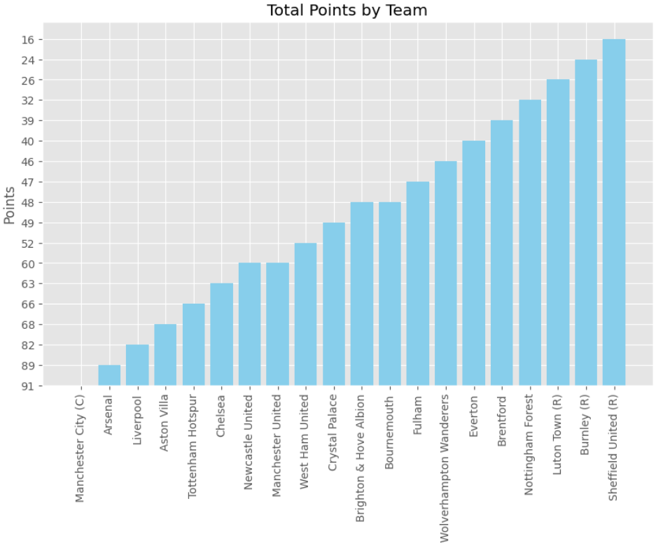
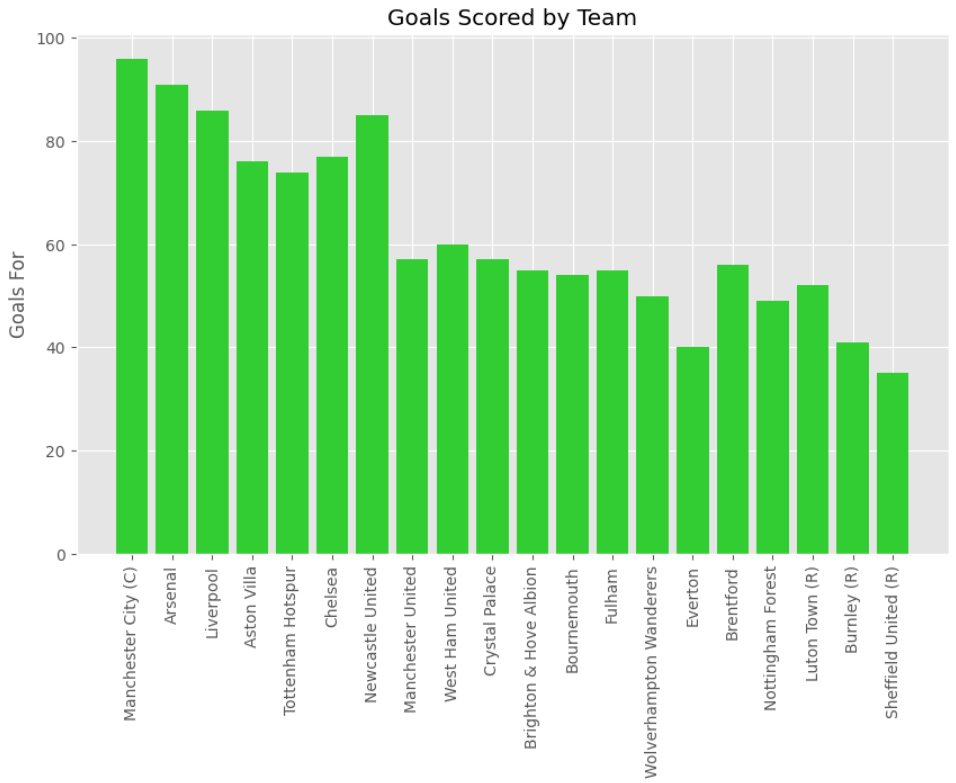
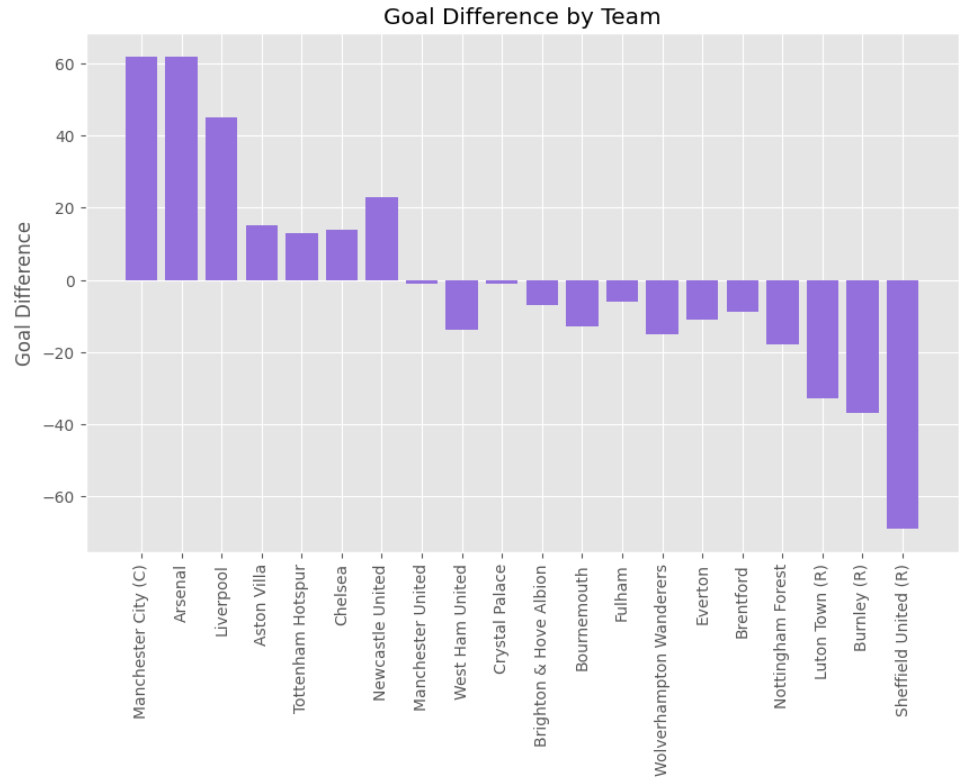
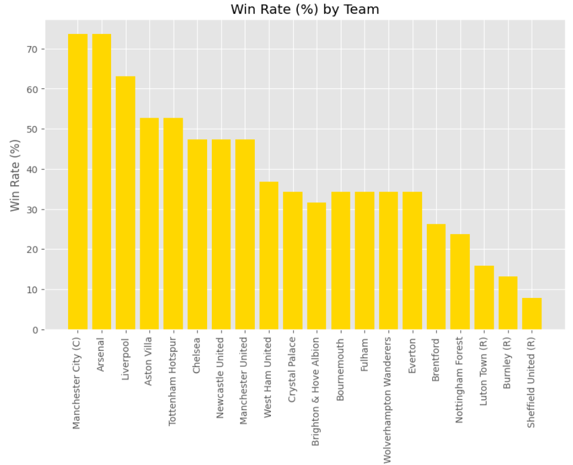
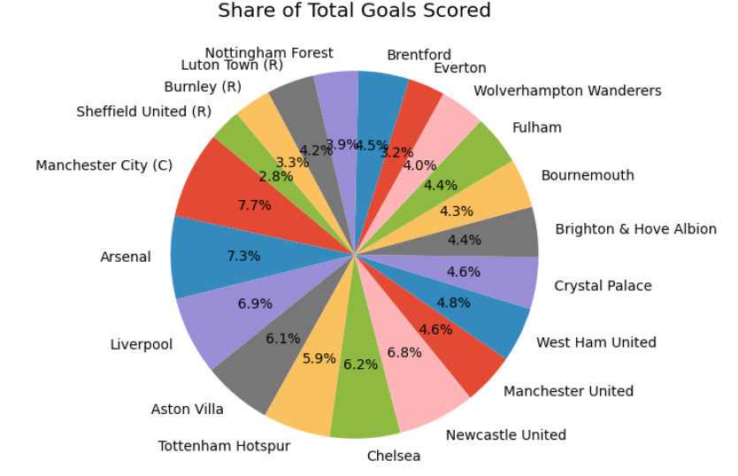
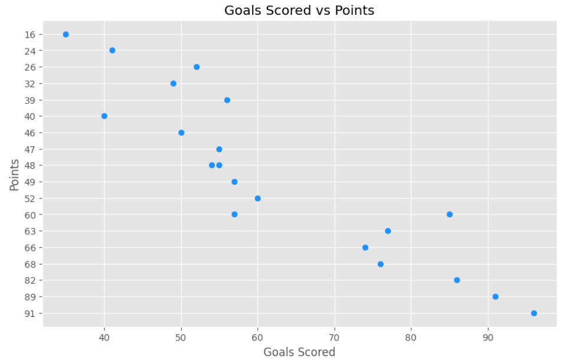
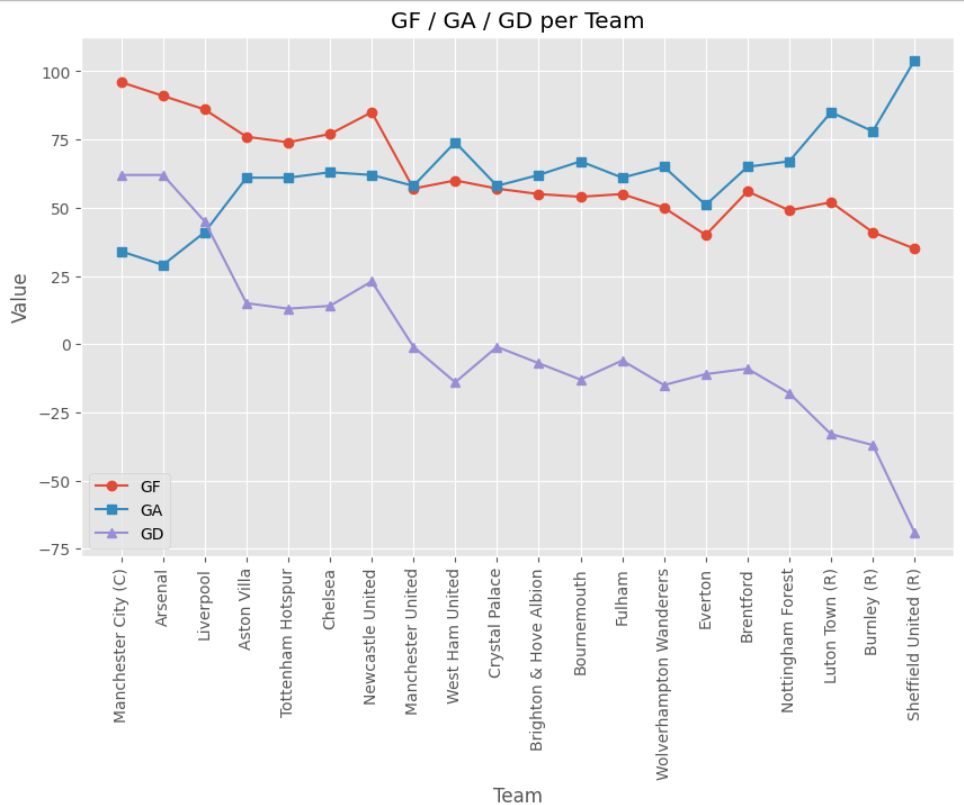

# 🏆 Premier League Standings Analysis (2024–25)

This project analyzes the **Premier League standings** using powerful Python libraries:  
**Pandas**, **NumPy**, and **Matplotlib**.

We extract key insights from a league table dataset, clean the data, engineer new features (like win rate), and visualize the results with informative plots.

---

## 📁 Dataset

The dataset contains the final league table for 20 teams in the Premier League.  
It includes columns such as:

- `Pos` – Final position
- `Team`
- `Pld` – Matches played
- `W`, `D`, `L` – Wins, Draws, Losses
- `GF`, `GA`, `GD` – Goals For, Goals Against, Goal Difference
- `Pts` – Points
- `Qualification or relegation` – Notes on European qualification or relegation

---

## 🔧 What We Did

### ✅ Data Cleaning
- Removed special characters (e.g. `[c]`, `[d]`) from `Pts` column
- Converted `GD` and `Pts` columns from object to numeric
- Handled Unicode minus signs (`−`) properly
- Filled or managed `NaN` values in optional columns

### 🧠 Feature Engineering
Created new analytical columns:
- **Win Rate (%)**
- **Draw Rate (%)**
- **Loss Rate (%)**
- **Goals Scored per Game**
- **Goals Conceded per Game**
- **Attack Ratio** (Goals Scored ÷ Goals Conceded)

### 📊 Visualizations
Included the following plots using **Matplotlib**:

1. Bar chart of total **Points**  
   

2. Bar chart of **Goals Scored**  
   

3. Bar chart of **Goals Conceded**  
   

4. Bar chart of **Goal Difference**  
   

5. Bar chart of **Win Rate**  
   

6. Pie chart showing each team’s share of total goals  
   

7. **Scatter plot**: Goals Scored vs Points  
   

8. **Line plot**: GF, GA, GD per team  
   

> All plots are saved inside the `plots/` directory.

---

## ❓ Key Analytical Questions

We explored and answered:
- Which teams overperformed or underperformed compared to their goal stats?
- Is there a team with high goals but low points?
- Who had the best defense?
- Which team had the most draws and lost momentum?
- Who had the most efficient scoring relative to points?

---

## 📦 Libraries Used

- `pandas`
- `numpy`
- `matplotlib.pyplot`

Install them with:

```bash
pip install pandas numpy matplotlib
```

## 📁 Directory Structure
bash
Copy
Edit
.
├── analysis.ipynb        # Jupyter notebook with full analysis
├── premier_league.csv    # Original dataset
├── plots/                # All generated plots
│   ├── points_bar.png
│   ├── goals_scored.png
│   └── ...
└── README.md             # This file

## 🙌 Contributions
Feel free to fork the repo, add more visualizations (like Seaborn or Plotly), or test other seasons!

## 📃 License
This project is open-source under the MIT License.
